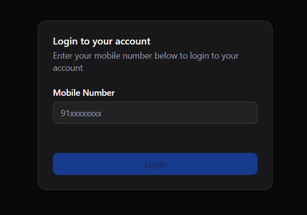
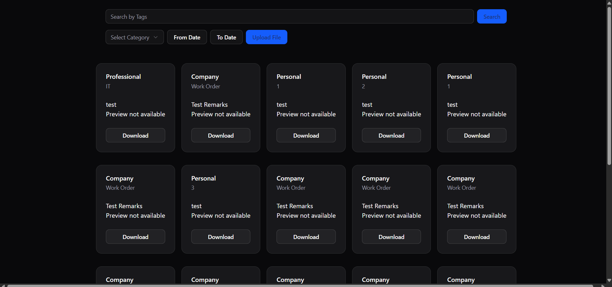
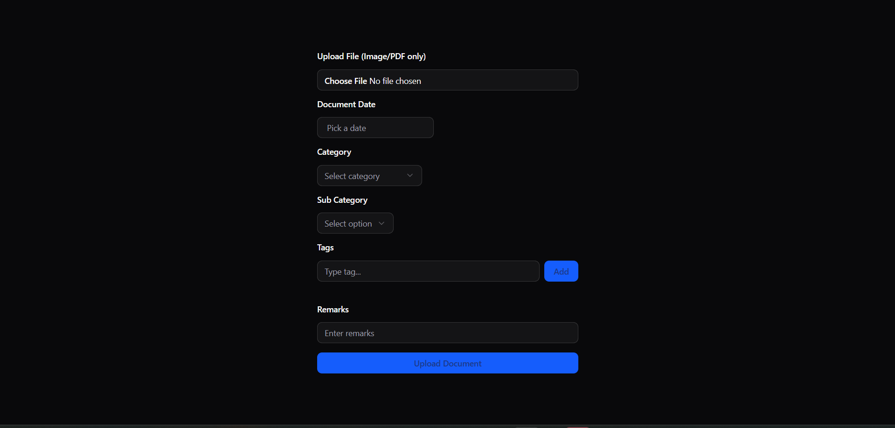

# Doc Managment System frontend

This project is a frontend interface for a Document Management System built as part of the Allsoft Front-End Developer assignment.
It allows users to login via OTP, upload and tag documents, search documents with filters, preview files, and download documents.

## Tech Stack

**Framework:** React + vite

**UI Library::** Shadcn (for clean UI)

**State Management:** React Context API

## Run Locally

Clone the project

```bash
  git clone https://github.com/girishsinha/DMC.git
```

Go to the project directory

```bash
  cd my-project
```

Install dependencies

```bash
  npm install
```

Start the server

```bash
  npm run dev
```

## Usage/Examples

Enter your phone number and fill OTP



explore file here



upload file here


